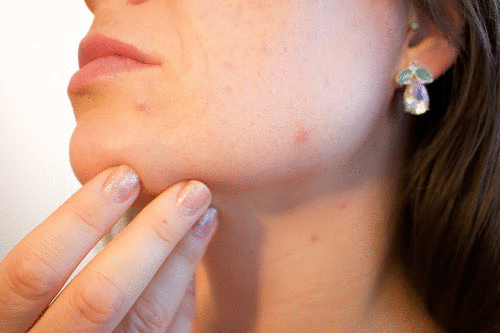
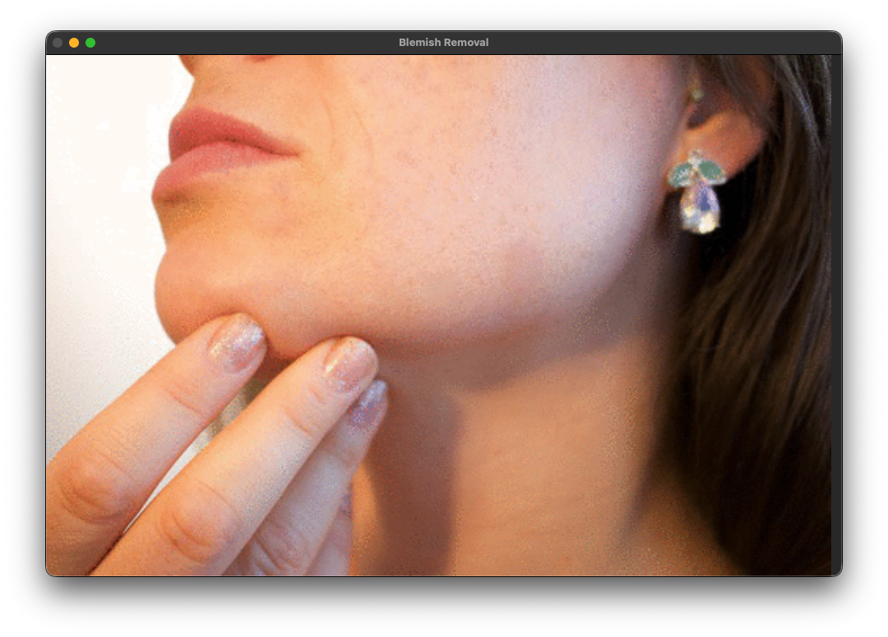

# Blemish-Removal
Skin smoothening removing blemishes on face in an image
# 🧴 Blemish Removal — Interactive Skin Retouching with OpenCV

> Click a blemish. Watch it vanish. Like magic — but it's math.


---

## ✨ What Is This?

**Blemish Removal** is an interactive image processing application that lets you remove skin blemishes with a single click. Powered by classical computer vision techniques — Sobel filtering, gradient analysis, and seamless cloning — it intelligently finds the cleanest nearby skin patch and blends it over the selected blemish, leaving no visible seam.

No deep learning. No giant models. Just elegant signal processing doing beautiful work.

---

## 🖼️ Before & After

| Before | After |
|--------|-------|
|  |  |

> *Left: Original image with visible blemishes. Right: After a few clicks with the tool.*

---

## 🔬 How It Works

The algorithm operates in two elegant steps:

### 1. 🔍 Find the Best Replacement Patch

Blemishes are characterized by **high local gradient magnitude** — they create sharp intensity transitions relative to surrounding smooth skin. The application exploits this property:

- Four candidate patches are sampled from the **neighborhood** of the clicked point (top, bottom, left, right), at a distance of `2r` pixels.
- Each patch is analyzed using **Sobel filtering** in both X and Y directions.
- The patch with the **lowest mean gradient** (i.e., the smoothest texture) is selected as the replacement — ensuring the donor patch matches the skin tone and lighting of the surrounding area.

```
Candidate Patch Sampling Layout:

              [ patch 2 ]
                  ↑
[ patch 3 ] ← [BLEMISH] → [ patch 1 ]
                  ↓
              [ patch 4 ]
```

### 2. 🎨 Seamless Blending

Rather than naively copying pixels (which would leave a harsh rectangular artifact), the application uses **`cv2.seamlessClone`** with `NORMAL_CLONE` mode. This is an implementation of Poisson image editing — it preserves the gradient field of the source patch while matching the boundary colors of the destination region, producing a seamless, natural-looking result.

---

## 🧮 The Science Behind It

### Spatial Domain: Sobel Filtering

The Sobel operator approximates the image gradient, highlighting regions of rapid intensity change:

```
Sobel X:          Sobel Y:          Laplacian:
[-1  0  1]        [-1 -2 -1]        [ 0  1  0]
[-2  0  2]        [ 0  0  0]        [ 1 -4  1]
[-1  0  1]        [ 1  2  1]        [ 0  1  0]
```

Blemishes appear as regions of **high gradient magnitude** compared to smooth skin. By finding the *minimum* gradient neighbor, we locate the most skin-consistent replacement patch.

### Frequency Domain: Fourier Analysis

Viewing the magnitude spectrum of the Fourier Transform reveals another perspective:
- **Smooth skin regions** → energy concentrated near the center (low frequencies)
- **Blemished regions** → energy spread outward (high frequencies)

This confirms that blemishes represent high-frequency anomalies within an otherwise low-frequency signal — making gradient-based detection both theoretically sound and practically effective.

---

## 🚀 Getting Started

### Prerequisites

```bash
pip install opencv-python numpy
```

### Run the App

```bash
git clone https://github.com/YOUR_USERNAME/blemish-removal.git
cd blemish-removal
python blemish_removal.py
```

> Update the `filename` variable in the script to point to your image.

### Controls

| Action | Effect |
|--------|--------|
| **Left Click** on a blemish | Removes the blemish using the best nearby patch |
| **ESC** | Exit the application |

---

## 📁 Project Structure

```
blemish-removal/
│
├── blemish_removal.py   # Main application script
├── images/
│   ├── blemish.png      # Sample input image with blemishes
│   └── result.png       # Expected output after processing
└── README.md
```

---

## 🛠️ Core Implementation

```python
def newBestPatch(x, y):
    """
    Samples 4 candidate patches around the clicked point,
    evaluates each using Sobel gradient magnitude,
    and returns the coordinates of the smoothest patch.
    """

def sobel(patch):
    """
    Computes mean Sobel gradient magnitude in X and Y directions
    for a given image patch. Lower mean = smoother texture.
    """

def blemishRemoval(event, x, y, flags, param):
    """
    Mouse callback: on left click, finds the best patch and
    applies seamless cloning to remove the blemish at (x, y).
    """
```

---

## 💡 Key Design Decisions

- **Patch radius `r = 15`** — empirically chosen to cover typical blemish sizes while keeping patches local enough to preserve skin consistency.
- **Sampling at `2r` distance** — ensures candidate patches don't overlap with the blemish itself.
- **Sobel over Laplacian** — the Laplacian is more sensitive to noise; Sobel provides a more stable gradient estimate for patch selection.
- **`cv2.seamlessClone`** — avoids the blocky artifacts of naive copy-paste, producing photorealistic results.

---

## 📚 Concepts Used

- Image gradient computation (Sobel filtering)
- Frequency domain analysis (2D Fourier Transform)
- Poisson image editing / seamless cloning
- Interactive OpenCV GUI with mouse callbacks

---

## 🤝 Contributing

This was built as a fun exploration of classical image processing. If you have ideas — smarter patch selection, undo functionality, a brush-size slider — feel free to open an issue or a pull request!

---

## 📄 License

This project is licensed under the MIT License. See [LICENSE](LICENSE) for details.

---

<p align="center">Built with ❤️ and a Sobel filter</p>
